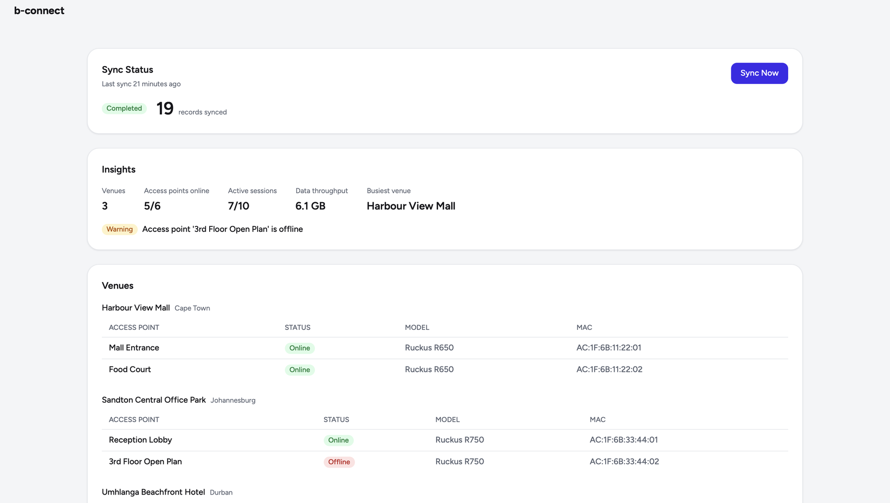
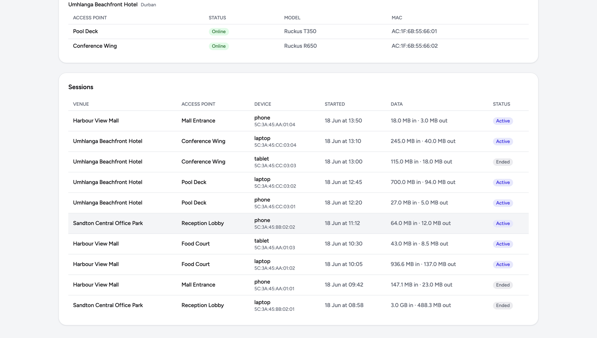

# b connect — Wi-Fi Controller Integration Dashboard

A small full-stack app that integrates with a (mocked) third-party Wi-Fi controller and surfaces its data in a clean operations dashboard. The backend pulls venues, access points, and connected-user sessions from the controller on demand, stores them through an ORM, and exposes them over a small REST API. The frontend lets an operator trigger a sync, watch its status, and browse what came back.

> Take-home assignment for b connect. Built with judgement and clear structure as the priority over polish.

---

## Screenshots

The dashboard — sync status, rule-based insights, and venues with their access points:



Sessions — connected users with venue, access point, device, start time, and data usage:



---

## What it does

- **Sync on demand** — pull the latest venues, access points, and sessions from the Wi-Fi controller
- **Safe re-syncs** — repeated syncs upsert by the provider's own id, so they never create duplicate rows
- **Observable** — every sync run is logged; the dashboard always shows the last sync time, status, and records synced
- **Resilient** — a controller failure is caught, recorded as a failed sync, and shown as a clear error — it never crashes the app

---

## Stack

| Layer               | Tool                              |
| ------------------- | --------------------------------- |
| Backend             | FastAPI (Python 3.11+) + Uvicorn  |
| ORM                 | SQLAlchemy 2.0                    |
| Validation          | Pydantic v2                       |
| Database            | PostgreSQL (SQLite fallback)      |
| Frontend            | React 18 + Vite + TypeScript      |
| Styling             | Tailwind CSS v4 (b connect light/indigo theme) |
| Local orchestration | Docker Compose (Postgres)        |

---

## Project structure

```
.
├── docker-compose.yml          # PostgreSQL (host port 5433)
├── backend/
│   ├── requirements.txt
│   ├── .env.example
│   └── app/
│       ├── main.py             # FastAPI app, CORS, router registration
│       ├── config.py           # Settings (DATABASE_URL, FAIL_SYNC, CORS_ORIGINS)
│       ├── database.py         # engine, session, get_db, init_db
│       ├── models.py           # Venue, AccessPoint, Session, SyncLog
│       ├── schemas.py          # Pydantic request/response models
│       ├── routers/            # sync.py, venues.py, sessions.py
│       ├── services/           # sync_service.py (pull → upsert → log)
│       └── mock_controller/    # provider.py + data.json (the fake controller)
└── frontend/
    └── src/
        ├── api/client.ts       # the only place that knows endpoint URLs
        ├── components/         # SyncStatusCard, VenuesTable, SessionsTable, StatusBadge, EmptyState
        ├── hooks/useSync.ts
        ├── utils/format.ts     # bytes / date / relative-time formatters
        └── types.ts
```

---

## Getting started

### Prerequisites

- Python 3.11+
- Node.js 18+
- Docker + Docker Compose (only for the Postgres path)

### 1. Backend

```bash
cd backend
python -m venv .venv && source .venv/bin/activate
pip install -r requirements.txt
uvicorn app.main:app --reload --port 8000
```

With no `.env` present, the backend uses a local **SQLite** database (`backend/app.db`) — zero setup, nothing else to install. Tables are created automatically on startup. The API is now at `http://localhost:8000`, with interactive docs at `http://localhost:8000/docs`.

To run against **PostgreSQL** instead, see [Database](#database) below.

### 2. Frontend

```bash
cd frontend
npm install
npm run dev
```

The dashboard runs at `http://localhost:5173` and talks to the backend at `VITE_API_URL` (defaults to `http://localhost:8000`). Click **Sync Now** to pull the controller snapshot; venues and sessions populate from the synced data.

### Environment variables

| Variable       | Where    | Default                     | Purpose                                     |
| -------------- | -------- | --------------------------- | ------------------------------------------- |
| `DATABASE_URL` | backend  | `sqlite:///./app.db`        | Database connection (Postgres or SQLite)    |
| `FAIL_SYNC`    | backend  | `false`                     | Set `true` to simulate a controller outage  |
| `CORS_ORIGINS` | backend  | `http://localhost:5173`     | Allowed frontend origin(s), comma-separated |
| `VITE_API_URL` | frontend | `http://localhost:8000`     | Backend base URL                            |

`backend/.env.example` documents these and is preconfigured for the Postgres path; copy it to `backend/.env` to use it.

---

## Database

The app runs on **PostgreSQL** (the production target) or **SQLite** (the zero-setup fallback) through a single `DATABASE_URL`. The SQLAlchemy models are written to work on both, so switching stores is a config change, not a code change. Both paths are verified end to end — sync, re-sync idempotency (no duplicate rows), the read endpoints, and the simulated-failure path all run identically on the SQLite default and on the PostgreSQL container below.

### Running on PostgreSQL

```bash
docker compose up -d db          # Postgres 15 on host port 5433
cd backend
cp .env.example .env             # DATABASE_URL points at localhost:5433
uvicorn app.main:app --reload --port 8000
```

> **Note on the port:** Postgres is published on host port **5433** (mapped to the container's 5432), because port 5432 is commonly already taken by another local Postgres. Credentials (`bconnect` / `bconnect` / db `bconnect`) are in `docker-compose.yml`. Connect with `docker compose exec db psql -U bconnect -d bconnect`.

---

## API

| Method | Endpoint        | Description                                                       |
| ------ | --------------- | ---------------------------------------------------------------- |
| POST   | `/sync`         | Pull from the controller, upsert by `provider_id`, log the run   |
| GET    | `/venues`       | List venues with their access points                             |
| GET    | `/sessions`     | List sessions (connected users) with venue + access-point context |
| GET    | `/sync-status`  | Most recent sync: status, last sync time, records synced         |
| GET    | `/insights`     | Rule-based summary: counts, busiest venue, throughput, anomaly flags |

A simulated controller failure (`FAIL_SYNC=true`) returns HTTP 200 with `status: "failed"` and an error message — a handled result, never a crash.

### Data model

`Venue` 1→N `AccessPoint`, `Venue`/`AccessPoint` 1→N `Session`, plus a `SyncLog` per run. Every synced entity carries a unique `provider_id` — the controller's own identifier and the key that makes re-syncs idempotent.

---

## Design decisions & trade-offs

- **PostgreSQL as the target, SQLite as a drop-in fallback.** Postgres is the production store and better demonstrates the relational modelling the assignment asks about. Everything goes through SQLAlchemy and a single `DATABASE_URL`, so SQLite runs the same code with zero setup — the default for quick local runs.
- **Upsert by `provider_id`, enforced at the schema level.** `provider_id` is `unique` on every synced table, so duplicate avoidance is a database guarantee, not just application logic. Sync upserts in a fixed order (venues → access points → sessions) to satisfy foreign keys.
- **Mock controller as a swappable module.** The fake provider lives behind a single `fetch_snapshot()` function returning a JSON snapshot, with a `FAIL_SYNC` flag to exercise the error path. Swapping in a real controller client is a one-file change.
- **Every sync writes a log row, even on failure.** This powers the status card and means failures are observable rather than silent.
- **`create_all` instead of migrations.** Acceptable for a take-home; Alembic would be the production choice.
- **Thin routers, logic in services.** Endpoints validate and delegate; the sync/upsert/logging logic lives in `services/`. Reads go straight through the `get_db` dependency.

---

## Assumptions

- The Wi-Fi controller exposes venues, access points, and sessions, each with a stable unique id (`provider_id`).
- Sync is operator-triggered, not scheduled — there is no background polling.
- A single operator uses the dashboard; no authentication or multi-tenancy is in scope.
- The controller returns a full snapshot per sync (not a delta), so each sync reconciles the full set.
- Session records may be open (`ended_at` null) for currently-connected users.

---

## What I'd improve with more time

- Alembic migrations instead of `create_all`
- Store the raw provider payload alongside normalised rows for auditing
- Pagination and filtering on the sessions endpoint
- A sync history view (not just the latest run) in the UI
- Configurable retry/backoff on transient controller failures
- A proper test suite (pytest + httpx) covering the sync/dedup contract
- Authentication and per-operator scoping
- An LLM-backed natural-language layer over the existing rule-based insights

---

## Use of AI tools

Built with the assistance of AI coding tools (Claude Code) for scaffolding, boilerplate, and documentation. All architectural decisions, the data model, and the integration approach were directed and reviewed by me.

---

## Status

Complete end to end — sync, status, venues, sessions, and a rule-based insights panel, all working against the API, on the b connect brand theme. Verified on both SQLite (the zero-setup default) and PostgreSQL (via the docker-compose container). The insights are rule-based (no external API/key); an LLM-backed summary is a natural next step.
